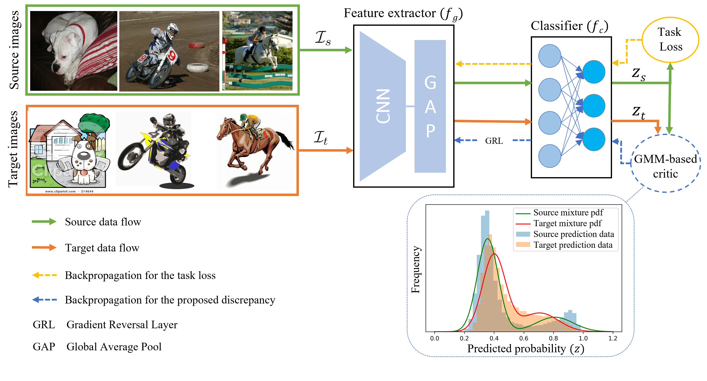

# DDA-MLIC
This repo is the official PyTorch implementation of "[Discriminator-free Unsupervised Domain Adaptation for Multi-label Image Classification](https://openaccess.thecvf.com/content/WACV2024/papers/Singh_Discriminator-Free_Unsupervised_Domain_Adaptation_for_Multi-Label_Image_Classification_WACV_2024_paper.pdf)" in WACV 2024.



## Citation
```bash
@inproceedings{singh2023discriminatorfree,
  title={Discriminator-free Unsupervised Domain Adaptation for Multi-label Image Classification},
  author={Singh, Indel Pal and Ghorbel, Enjie and Kacem, Anis and Rathinam, Arunkumar and Aouada, Djamila},
  booktitle={Proceedings of the IEEE/CVF Winter Conference on Applications of Computer Vision},
  year={2024}
}
```

## Datasets
1. [AID](https://github.com/Hua-YS/AID-Multilabel-Dataset)
2. [UCM](http://weegee.vision.ucmerced.edu/datasets/landuse.html) ([Labels](https://bigearth.eu/datasets.html))
3. [DFC](https://github.com/Hua-YS/DFC15-Multilabel-Dataset)
4. [PASCAL VOC 2007](http://host.robots.ox.ac.uk/pascal/VOC/voc2007/)
5. [Clipart1k](https://github.com/naoto0804/cross-domain-detection)
6. [Cityscapes](https://www.cityscapes-dataset.com/)
7. [Foggycityscapes](https://www.cityscapes-dataset.com/)

## Pre-trained models
We provide a collection of models trained with the proposed GMM-based discrepancy on various multi-label domain adaptation datasets.


| **Source** | **Target** | **mAP** |
| --- | --- | --- |
| AID | UCM | [63.2](https://uniluxembourg-my.sharepoint.com/:u:/g/personal/inder_singh_uni_lu/EbagAy1tiPBLs5Vb0a2E5JsBYZNhGHcKev29WZxSQJMS4w?e=MPef8S) |
| UCM | AID | [54.9](https://uniluxembourg-my.sharepoint.com/:u:/g/personal/inder_singh_uni_lu/EZil5hpCH7BFrNjG15sYreYB3WjZWYbtpE8k3W1Nb14F2A?e=Syj4bu) |
| AID | DFC | [62.1](https://uniluxembourg-my.sharepoint.com/:u:/g/personal/inder_singh_uni_lu/EegkhqwqnetErwd6WQICzGcBE_SmzVgY0p6sjDJ-KQniXA?e=HHAVa8) |
| UCM | DFC | [70.6](https://uniluxembourg-my.sharepoint.com/:u:/g/personal/inder_singh_uni_lu/EdL6WOzj-3NDqx8pH1J7p5wBUKGxzPDELJhVvcUMJhi7uQ?e=ZJDVnT) |
| VOC | Clipart | [61.4](https://uniluxembourg-my.sharepoint.com/:u:/g/personal/inder_singh_uni_lu/ESJrT33eJ_9NjBSRMxn8_9kBVfXD0UNITQWQcmb06woB3Q?e=VcMZay) |
| Clipart | VOC | [77.0](https://uniluxembourg-my.sharepoint.com/:u:/g/personal/inder_singh_uni_lu/EbTsNp8q3alOnrs94arLxjsB85qF_Z183H64x1N3ZyZR3Q?e=IscUeS) |
| Cityscapes | Foggycityscapes | [62.3](https://uniluxembourg-my.sharepoint.com/:u:/g/personal/inder_singh_uni_lu/EdoyiQLExCdNiwAiyeum0UEBrFfjz8AVypAaBBUbfy2DQQ?e=g3IsW0) |

## Installation
Create virtual environment

```bash
$ python3 -m venv dda_mlic
```

Activate your virtual environment

```bash
$ source dda_mlic/bin/activate
```

Upgrade pip to the latest version

```bash
$ pip install --upgrade pip
```

Install compatible CUDA and pytorch versions.

```bash
$ pip install torch==1.9.0+cu111 torchvision==0.10.0+cu111 torchaudio==0.9.0 -f https://download.pytorch.org/whl/torch_stable.html
```

Install other required packages from requirements.txt

```bash
$ pip install -r requirements.txt
```

## Evaluation

Syntax: Source &rarr; Target
```bash
$ python main.py --phase test -s <name_of_source_dataset> -t <name_of_target_dataset> -s-dir <path_to_source_dataset_dir> -t-dir <path_to_target_dataset_dir> --model-path <path_to_pretrained_weights>
```

Example: AID &rarr; UCM
```bash
$ python main.py --phase test -s AID -t UCM -s-dir datasets/AID -t-dir datasets/UCM --model-path models/aid2ucm_best_63-2.pth
```

## Training

[Download](https://miil-public-eu.oss-eu-central-1.aliyuncs.com/model-zoo/ImageNet_21K_P/models/tresnet_m_miil_21k.pth) the imagenet pretrained weights for TResNetM.

Syntax: Source &rarr; Target
```bash
$ python main.py -s <name_of_source_dataset> -t <name_of_target_dataset> -s-dir <path_to_source_dataset_dir> -t-dir <path_to_target_dataset_dir> --model-path <path_to_imagenet_pretrained_weights>
```

Example: AID &rarr; UCM
```bash
$ python main.py -s AID -t UCM -s-dir datasets/AID -t-dir datasets/UCM --model-path models/tresnet_m_miil_21k.pth
```

## Acknowledgement
We create our code based on the following repositories:

[Transfer Learning Library](https://github.com/thuml/Transfer-Learning-Library)

[TResNet/ASL](https://github.com/Alibaba-MIIL/ASL)

[ImageNet21k](https://github.com/Alibaba-MIIL/ImageNet21K)

Thanks to the authors.


